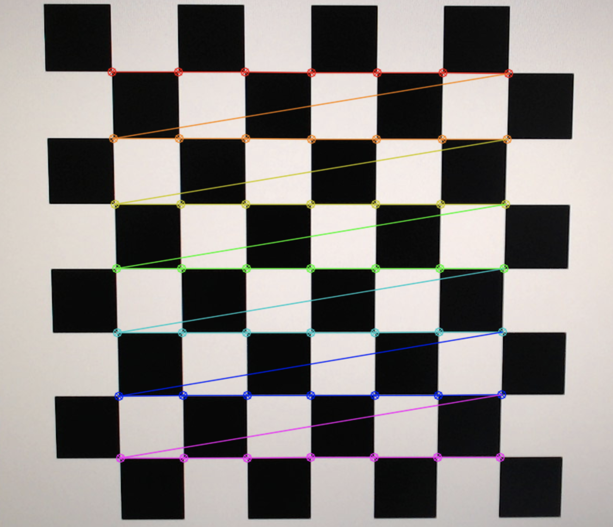

# Camera Calibration with OpenCV

Read more about [the Intrinsic Matrix here](http://ksimek.github.io/2013/08/13/intrinsic/).

## Instructions
- Install python 3
- `pip install -r requirements.txt`
- `python main.py` 

It will pop up a window. What you need to do is to move the 8x8 checkerboard in front of the camera until 30 frames is colleced. Make the variation of view angle & distance as large as possible. Camera intrinsic parameters will be computed and stored in `camera_parameters.json`.

## Sample Output




```
Valid Frame: 1/30
Valid Frame: 2/30
...
Valid Frame: 30/30
[[920.68754397   0.         679.63443165]
 [  0.         920.33167683 361.67607775]
 [  0.           0.           1.        ]]
Total error:  0.058103822447327494
```

**Note:** code adapted from [ARchess](https://github.com/zuoym15/ARchess)